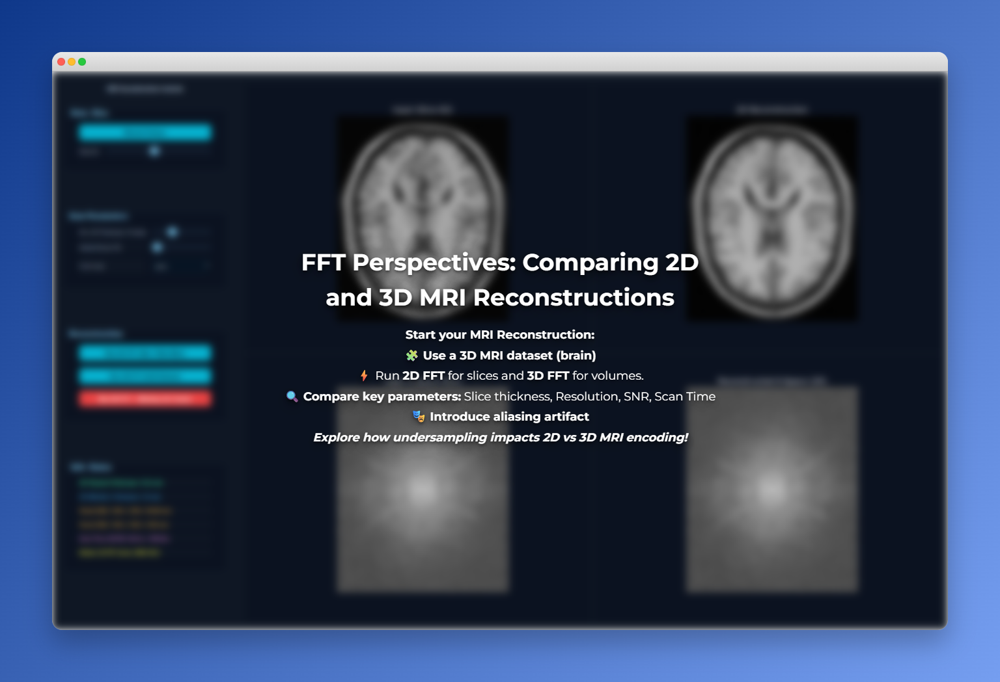
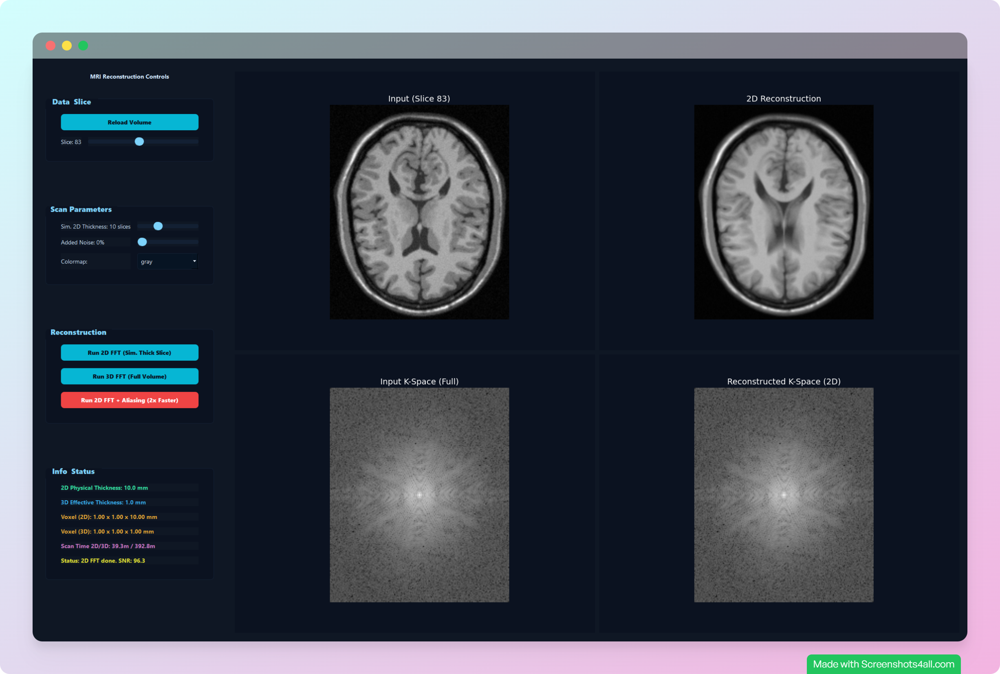
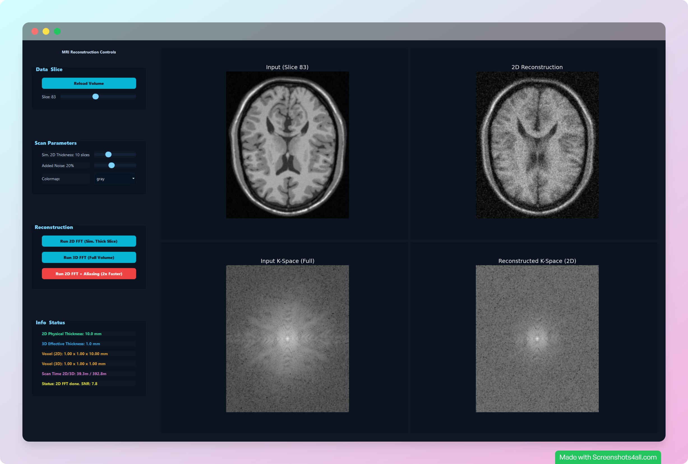
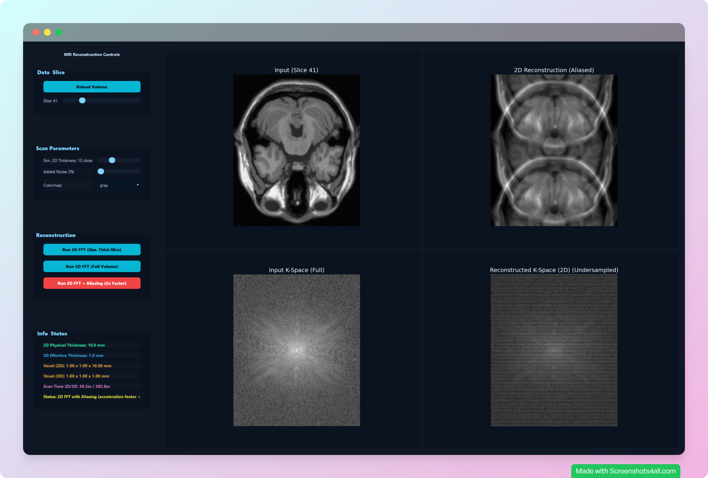
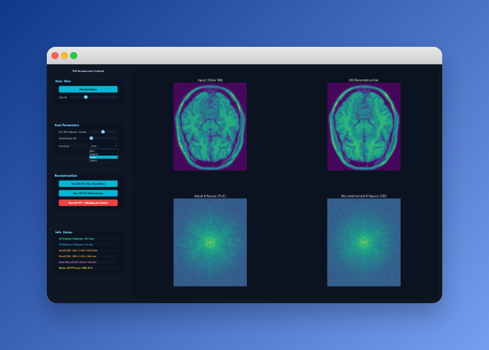

# MRI Reconstruction & Aliasing Explorer

This tool demonstrates how **2D vs 3D FFT encoding** works in MRI, and how **k-space undersampling** introduces artifacts such as noise and aliasing.  

---

  
> Explore how slice thickness, resolution, sharpness, and scan time differ between 2D and 3D MRI reconstructions.

---

## User Interface

  

## How It Works
- Apply **2D FFT** and **3D FFT** reconstruction on 3D MRI dataset of the brain.  
- Compare **slice thickness, resolution, sharpness/SNR, and scan time**.  
- Add **aliasing artifacts** by reducing k-space phase-encoding lines.  
- Visualize results with **noise simulation** and **color maps**. 

---

### Noise
  
*Simulating random disturbances in the reconstruction.*  

### Aliasing
  
*Shows aliasing artifacts caused by undersampling k-space phase-encoding lines.*  

### Color Map
  
*Color map feature for better visualization of reconstructed slices.*  

---

## Goal
To provide an **interactive exploration** of MRI encoding and reconstruction, helping students and researchers understand the **trade-offs between 2D and 3D approaches** and the impact of undersampling.

---
